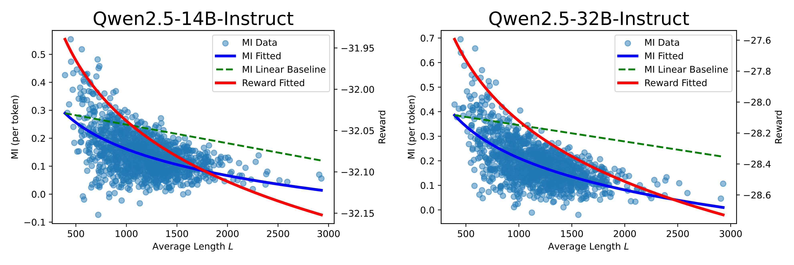
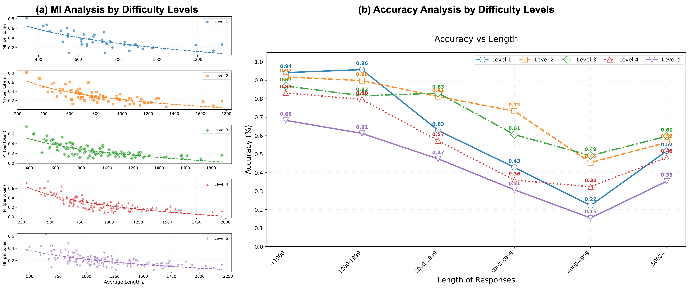
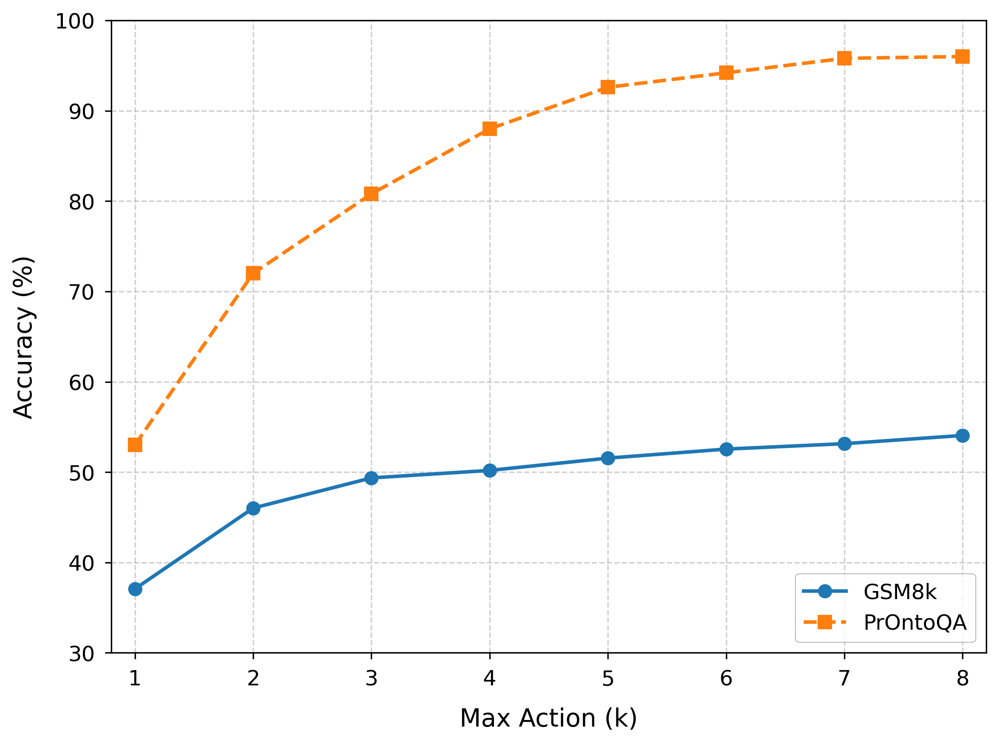

# Extra Experiments

## Larger LLMs
We have conducted extra experiments on larger LLMs including Qwen2.5-14B-Instruct and Qwen2.5-32B-Instruct, with the same setting as results in Fig.2 of our main text. 

## Analysis by Difficulty
We have conducted extra experiments to analyze the mutual information (MI) and accuracy by different difficulty levels. The experiments are performed on MATH-500, where the questions are divided into 5 different difficulty levels (level 1 for the simplest, level 5 for the most difficult). The questions at the same level share similar difficulty. 

(a) The MI analysis by difficulty levels. We present the relationship between the estimated MI and average response length at different levels. For all 5 levels, we observe similar MI decay phenomena like Fig.2 in our main text. 

(b) The accuracy analysis by difficulty levels. We present the relationship between the average accuracy and the length of responses at different levels. For all 5 levels, we observed that accuracy generally decreases with response length. Furthermore, the accuracy of the simplest level 1 decreases significantly when length increases, demonstrating the harm of overthinking. 

## Influence of $k$

